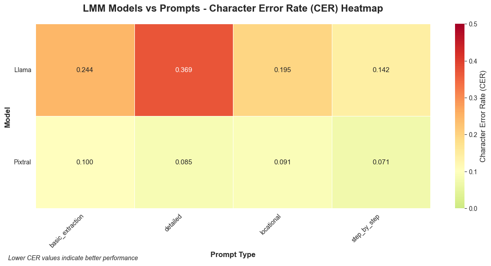

# Applied AI/ML OCR Approaches for Construction Industry Invoice Data Extraction - Final Test Analysis

This analysis framework focuses on understanding the experimental results from the construction invoice processing study, incorporating controlled experimental design considerations and practical system improvement insights.

The primary variable tested was the performance of open source LMM models vs open source OCR software. Additional consideration is given to the performance of Self-Attention (Llama) vs cross-attention (Pixtral) models. Different prompting strategies were incorporated for consideration.

The test data comes from a real-world general contractor in the Washington, D.C. area. This selection of the 50 images in the test set was specifically curated for their consistency in format and photo quality. Two numeric data fields were chosen for extraction mostly because ground-truth data was readily available for these fields in the contractor's digital records. While the "total cost" data field was processed as a numeric data type the "Work Order Number" data type was processed as a string allowing as it could potential include alpha-numeric characters.

Accuracy was used as the primary metric for analysis and evaluated as a binary outcome for each data field extracted from each image during the course of a single test-run. (Basically if the model returned the ground truth data 40 times in the 50 image test the accuracy would be 80%). Evaluating the work order number as a string also enabled character error rate to be calculated on the extraction of that data. Where applicable CER is used to amplify and further investigate the results of these trials. It should be noted that this measure was only performed on the work order number data field.

This analysis begins with a focus on the interactions of model type, prompt type, and field type on the accuracy of the results produced. It then looks at measures of spread in the results as indicative of model consistency and expectations of performance at scale. The analysis next focuses on the efficiency frontier presented by these models to better understand the trade-off between processing time and accuracy. Finally, a horizontal analysis of each individual image is presented to investigate how characteristics of the images themselves might be impacting model performance.

## Broad Conclusions Up Front

- LMMs outperform OCR
- The combination of the Llama model with step-by-step prompting yielded the best accuracy, especially with the numeric field "Total Cost"
- The Pixtral model both with basic, detailed, and step-by-step prompting provided the most consistent results and the most computationally effective results
- There were a few "sticky" images that seemed hard for all the models. Looking at these images it likely was a handwriting issue.

## 1. Overall Model Performance

### 1.1 LMM vs. OCR

### 1.2 Model Specific Comparisons

## Section 2: Prompt and Field Type Comparison

Four different prompt types were compared across both the Pixtral and the Llama LMMs.

### 2.1 Overall Prompt Analysis

Most prompts performed equally well overall reaching close to 80%. The step-by-step prompt clearly outperformed the other prompt types in CER.

### Section 2.2: Field-Specific Analysis

It was much easier for the models to find the total cost and extract it successfully than the work order number.

## 3. Model, Prompt, and Field Type - Detailed Variable Analysis

### 3.1 LMM Models vs Prompts

**MODELS VS. PROMPTS** Llama Step-by-Step is the best Model-Prompt combination based on Accuracy, Pixtral Step-by-Step is the best based on CER

### 3.2 LMM Query Types vs Prompts

Cross-analysis of how different prompt types perform on specific query types (Work Order vs Total Cost extraction).

Easier to get total cost than work order number. Step-by-step prompting continues to show an advantage across query types.

### 3.3 Comprehensive Model-Prompt Combination vs Accuracy

Comprehensive comparison of all model configurations (LMM + OCR) across query types. Models are sorted by average performance for easy identification of best performers. CER was only calculated on the Work Order Field while accuracy on a true false scale was computed for both fields in each model-prompt combo and each choice of recognition model when running the OCR tests.

On a pure accuracy standpoint Llama Step-by-step is the clear winner.

## 4. Model Consistency Study

Analysis of model consistency and performance variability. Lower ranges indicate more consistent performance across different experiments. Intended to look at spread of results between models and answer such questions as: How reliable are the results we are getting from each model? Can we expect similar results at scale?

### 4.1 Consistency over Accuracy

Llama has a higher max accuracy than Pixtral but Pixtral is more consistent. It has a smaller range of results well clustered around its mean accuracy.

### 4.2 Consistency over Character Error Rate (CER)

CER consistency analysis across model types. Lower ranges indicate more predictable character-level error rates.

Llama actually performs the worst in terms of CER spread.

### 4.3. Range vs Accuracy and CER Scatter

Look at the tradeoff between range and accuracy.

Side-by-side analysis of performance gaps between Total Cost and Work Order extraction across different performance metrics. Positive gaps indicate Total Cost is easier to extract, negative gaps indicate Work Order is easier.

### 4.4 Model Accuracy Distributions

Llama step-by-step still outperforms Pixtral in terms of accuracy, but the cluster of pixtral models shows comparable performance with lower spread. Pixtral-detailed and pixtral step-by-step show promise as consistent models whose accuracy can be improved with training.

## 5. Compute Resource (Timed) Comparison

This section examines the tradeoff between compute time and accuracy.

The tradeoff here is clear. Llama step-by-step comes the closest to meeting industry standards in accuracy however it takes about 5 seconds per trial - twice that of the Pixtral model. Improvements to the pixtral accuracy with training could result in large compute-time savings.

## 6. Error Pattern Taxonomy & Horizontal (Image Specific) Performance

### 6.1 Horizontal (Image Specific) Performance

Look at all images across model-prompt combinations to see if there are any particularly "sticky" images. This information can be useful feedback for pre-processing and subsequent in-production training.

There are a few images that can't be solved by any model-prompt combination. Further study could examine these images for the characteristics that are common across them. This information can inform future pre-processing efforts. Similarly, future exploration could explore the causes behind an image characteristics that are processed well on one model but not the other.

A cursory examination shows handwriting and strike-throughs as the most likely underlying cause of the "sticky" images. A more thorough investigation could help with pre-processing and flagging these images or providing updated prompting to the model to improve performance.

### 6.2 Categories of Error (Typal Analysis)

Characterize the problems we are getting from the models to see what models fail in which ways. Good feedback for future improvements.

Llama step-by-step gets the most exactly right while pixtral-detailed gets the least totally wrong and limits their errors to partial matches. Could be solved with training.

Llama seems to be the clear winner on the total cost category with llama step-by-step the best of the best.

## 7. Conclusion and Way-Ahead

### 7.1 Key Findings Summary

This comprehensive evaluation of OCR and Large Multimodal Models (LMMs) for construction invoice data extraction reveals significant performance differentials and actionable insights for industry deployment.

**Overall Performance Hierarchy:**

1. **Llama Vision Models** - Superior numeric extraction performance
2. **Pixtral Models** - Most consistent and computationally efficient
3. **DocTR OCR** - Baseline performance, significant room for improvement

### 7.2 Model-Specific Performance Analysis

#### 7.2.1 Llama Vision Model Performance

- **Total Cost Extraction**: 92% baseline accuracy, **94% with step-by-step prompting** (best overall)
- **Work Order Number Extraction**: 66% accuracy with 24.4% character error rate
- **Optimal Configuration**: Step-by-step prompting yields superior results for numeric fields
- **Strengths**: Exceptional performance on clearly formatted numeric data ($ signs, decimal patterns)
- **Weaknesses**: Higher character error rates on alphanumeric strings, more computationally intensive

#### 7.2.2 Pixtral Model Performance

- **Total Cost Extraction**: 80% baseline accuracy across prompting strategies
- **Work Order Number Extraction**: 66% accuracy with **7.1% character error rate** (significantly lower than Llama)
- **Optimal Configuration**: Consistent performance across basic, detailed, and step-by-step prompting
- **Strengths**: Superior consistency, lower character error rates, more efficient I/O processing
- **Weaknesses**: Lower peak accuracy on numeric extraction compared to Llama

#### 7.2.3 DocTR OCR Performance

- **Total Cost Extraction**: 49.4% accuracy (across 7 test configurations)
- **Work Order Number Extraction**: 37.4% accuracy
- **Strengths**: Traditional OCR approach, potentially faster for simple text extraction
- **Weaknesses**: Significantly lower accuracy across all metrics, struggles with invoice format complexity

### 7.3 Strategic Recommendations by Use Case

#### 7.3.1 High-Accuracy Numeric Processing

**Recommendation**: Llama Vision with step-by-step prompting

- **Rationale**: 94% accuracy on total cost extraction meets industry requirements
- **Implementation**: Fine-tuning and post-processing can achieve production-grade performance
- **Deployment**: Suitable for cloud-based processing where computational resources are available

#### 7.3.2 Large-Scale Consistent Processing

**Recommendation**: Pixtral with any prompting strategy

- **Rationale**: Consistent 80% accuracy with 7.1% character error rate provides reliable baseline
- **Implementation**: Self-attention mechanism enables efficient scaling
- **Deployment**: Optimal for high-volume processing with moderate accuracy requirements

#### 7.3.3 Resource-Constrained Environments

**Recommendation**: Enhanced DocTR with pre-processing pipeline

- **Rationale**: While baseline performance is low, fine-tuning potential exists
- **Implementation**: Significant training investment required to reach industry standards
- **Caveat**: May not be cost-effective given LMM alternatives

### 7.4 Error Pattern Analysis and Mitigation Strategies

#### 7.4.1 Common Failure Modes

- **Handwritten elements**: Consistent challenge across all models
- **Strike-through text**: Causes confusion in data extraction
- **Image quality variations**: Affects extraction consistency
- **Format inconsistencies**: Models struggle with non-standard invoice layouts

#### 7.4.2 Recommended Mitigation Approaches

1. **Pre-processing Pipeline**: Image quality enhancement and handwriting detection
2. **Hybrid Approach**: Combine model strengths (Llama for numeric, Pixtral for text)
3. **Human-in-the-Loop**: Flag low-confidence extractions for manual review
4. **Training Data Augmentation**: Focus on challenging image characteristics

### 7.5 Production Implementation Roadmap

#### 7.5.1 Short-term (3-6 months)

- Deploy Llama step-by-step for critical numeric extraction
- Implement Pixtral for high-volume text processing
- Develop confidence scoring system for extraction quality assessment

#### 7.5.2 Medium-term (6-12 months)

- Fine-tune models on domain-specific construction invoice datasets
- Implement hybrid processing pipeline combining model strengths
- Develop automated quality assurance and error correction mechanisms

#### 7.5.3 Long-term (12+ months)

- Explore model miniaturization for local deployment scenarios
- Investigate custom model training for construction-specific document types
- Scale processing capabilities to handle enterprise-level document volumes

### 7.6 Technical Architecture Considerations

#### 7.6.1 Deployment Options

- **Cloud-based**: Llama models for maximum accuracy
- **Edge computing**: Pixtral models for balanced performance/efficiency
- **Hybrid architecture**: Route documents based on complexity and accuracy requirements

#### 7.6.2 Integration Recommendations

- **API-first design**: Enable seamless integration with existing contractor management systems
- **Batch processing capabilities**: Handle large document volumes efficiently
- **Real-time processing**: Support immediate invoice processing for time-sensitive operations

### 7.7 Economic Impact Assessment

The performance differentials translate to significant operational benefits:

- **Llama deployment**: 94% accuracy reduces manual review by approximately 85%
- **Pixtral deployment**: 80% accuracy with lower computational costs provides optimal ROI for high-volume scenarios
- **Error reduction**: Lower character error rates (7.1% vs 24.4%) significantly reduce downstream processing errors

This analysis provides a robust foundation for evidence-based model selection and deployment strategies in construction industry invoice processing applications.